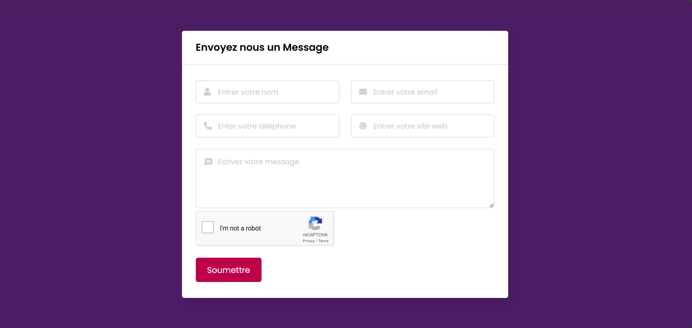

# Formulaire de Contact
Un simple formulaire de contact créé avec HTML, CSS, JavaScript, et PHP. Ce formulaire permet aux utilisateurs d'envoyer des messages qui seront traités côté serveur en PHP.

Aperçu du Projet
```sh

```


##Structure du projet
```sh
📂 votre-repertoire-de-projet
├── index.html          # Page HTML du formulaire
├── styles.css          # Fichier de style CSS
├── script.js           # Script JavaScript pour la validation
├── process.php         # Script PHP pour traiter le formulaire
└── screenshot.png      # Capture d'écran du formulaire
```


<br/>
Prérequis
Avant de commencer , assurez vous d'avoir ces élément instalés :

Un serveur Web supportant PHP (ex: Apache, Nginx ou XAMPP). <br/>
PHP version 7.0 ou supérieure.

## Installation

1. Cloner le depot:
```sh
git clone https://github.com/Omarseck6/Projet_Formulaire_de_Contact.git
```
2. Placez le dossier dans votre serveur web (ex: le dossier htdocs pour XAMPP).
3. Lancez le serveur et ouvrez index.html dans votre navigateur.

## Utilisation

Remplissez les champs du formulaire.<br/>
Cliquez sur "Envoyer" pour soumettre les informations.<br/>
Si tous les champs sont valides, le formulaire sera soumis et un email sera envoyé.

"" License
This project is licensed under the MIT License.


